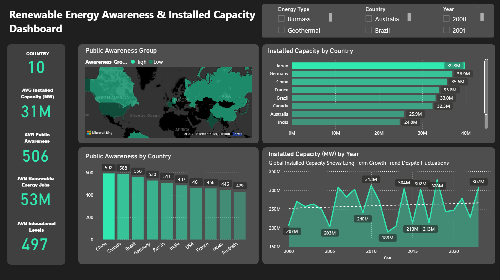
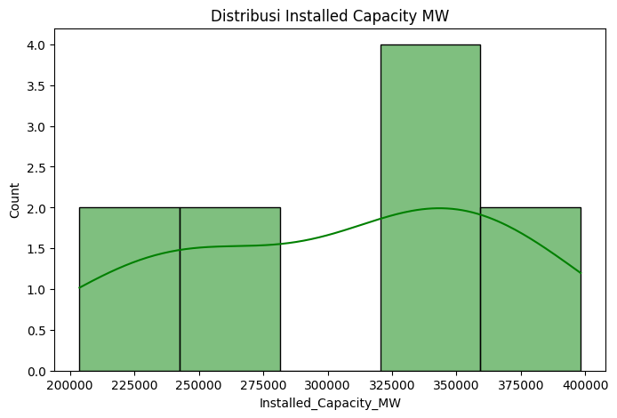
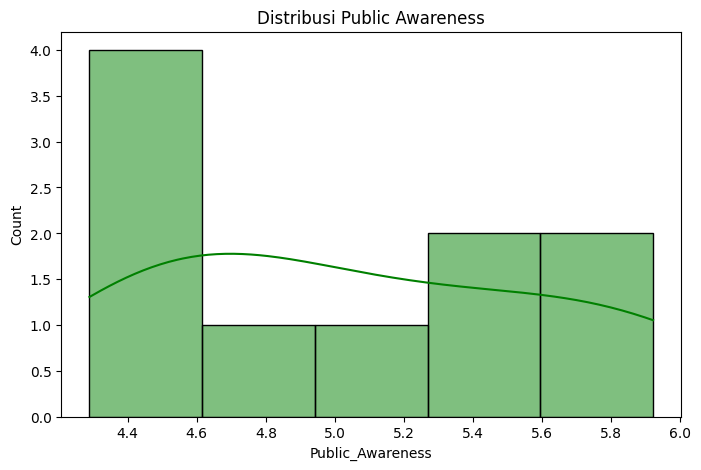
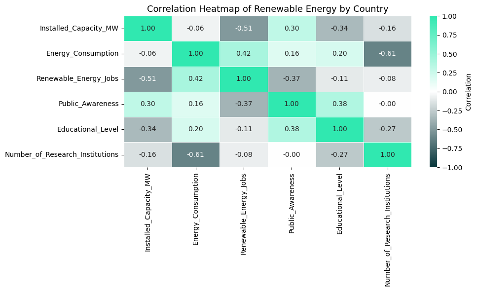

# 🌍 Final Project Data Analyst — Public Awareness & Renewable Energy Capacity

# 🎯 Objective
- Menganalisis apakah Public Awareness memiliki pengaruh signifikan terhadap Installed Capacity energi terbarukan pada berbagai negara (tahun 2023).
- Metode utama: A/B Testing menggunakan independent t-test.

# 🗃️ Dataset
- Sumber: Kaggle — complete_renewable_energy_dataset
- Jumlah data: 2.500 baris × 56 kolom (2000–2023)
- Fokus: Data tahun 2023
- Fitur relevan:
  - Country
  - Year
  - Installed Capacity (MW)
  -Public Awareness
  - Educational Levels
  - Renewable Energy Jobs
  - Number of Research Institutions
- Preprocessing:
  - ✅ No missing values
  - ✅ No duplicates
  - ✅ Filter dataset → tahun 2023

# 🧩 Metodologi
- Data Preparation
  - Aggregasi indikator utama (Installed Capacity, Public Awareness, dll).
  - Ekspor dataset agregat (df_2023_agg) untuk dashboard.
  - Exploratory Data Analysis (EDA)
  - Distribusi Installed Capacity antar negara (rata-rata 306.508 MW, max 398.155 MW).
  - Distribusi Public Awareness (4.29–5.92, cenderung menengah-rendah).
  - Korelasi: Public Awareness ↔ Installed Capacity (r = 0.30), Education ↔ Public Awareness (r = 0.38).

- A/B Testing
  - Unit analisis: negara
  - Grouping: median Public Awareness (tinggi vs rendah)
  - Metric: Installed Capacity
  - Uji asumsi: normalitas (Shapiro), homogenitas varians (Levene)
  - Uji hipotesis: Independent t-test

# 📈 Hasil
- p-value = 0.4328 > 0.05 → gagal menolak H0.
- Tidak ada perbedaan signifikan rata-rata Installed Capacity antara negara dengan Public Awareness tinggi vs rendah.
- Korelasi positif (r = 0.30), namun tidak cukup kuat untuk jadi faktor utama.
- Insight: Public Awareness penting, tapi dampaknya baru terasa jika didukung faktor lain (pendidikan, kebijakan, investasi, teknologi)

# 💡 Recommendations
- Bangun kesadaran publik sebagai fondasi jangka panjang (meskipun tidak signifikan, tetap relevan).
- Fokus pada pendidikan energi → edukasi dapat meningkatkan awareness.
- Pendekatan lintas sektor → kombinasikan kebijakan, teknologi, investasi, dan edukasi untuk hasil nyata.
- Validasi lebih lanjut dengan dataset longitudinal (panel) agar lebih kuat secara statistik

# 📊 Visual

